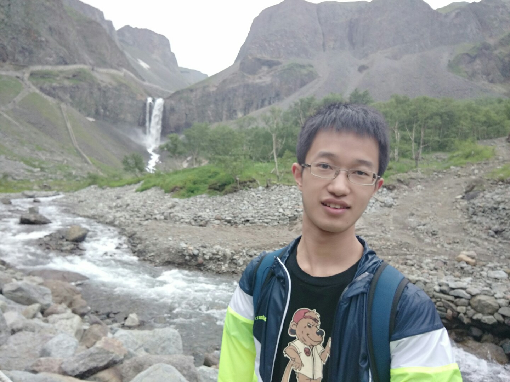

## About Me

Hi, I'm Xisen Jin. I am a senior(4th) year undergraduate student in Fudan University, China, majored in Computer Science and Technology. 

The photo is taken in Turin, Italy, while attending CIKM'18 where I gave an oral presentation.

## Research Interest

My research interests mainly lie on Natural Language Processing. Specifically, I am interseted two complementary fields: learning explicit and structured knowledge out of data, and learning hidden but powerful representation of data.  

> I started my research with dialogue systems. While dialogue systems are easy to start with, it is almost an ultimate goal of natural language processing. These efforts may push us towards this ultimate goal.
> - Infusing world facts or domain knowledge into dialogue generation, or in reverse, disentangle structural knowledge from them.
> - Modeling of grammar, discourse relationships and dialogue process in human interactions in unsupervised or semi-supervised manner.
>
> And I am on the way of these explorations and have some publications on these areas. [Publications](#publications)

## Education

<b>Fudan University,</b> 2015.9 - present

<b>National University of Singapore</b> 2017.8 - 2017.12

## Research & Interns

<b>Natural Language Processing Group</b>, School of Data Science

Research Assistant, From Oct. 2017 to present

- Advisor: [Dr. Zhongyu Wei](https://wei-zhongyu.github.io/)

<b>[Web Information Retrieval / Natural Language Processing Group (WING)](http://wing.comp.nus.edu.sg/)</b>, National University of Singapore

Research Assistant, From Aug. 2017 to Dec. 2017

- Advisor: Wenqiang Lei, [Dr. Min-Yen Kan](http://www.comp.nus.edu.sg/~kanmy/)

<b>[Data Science Lab, JD.com](http://datascience.jd.com)</b>, Beijing, China

Research Assistant, From Dec. 2017 to Feb. 2018
- Advisor: [Dr. Zhaochun Ren](https://sites.google.com/site/zren87/), [Dr. Dawei Yin](http://www.yindawei.com/)

<b>[Mircosoft Research Asia](https://www.microsoft.com/en-us/research/)</b>, Beijing, China

Research Assistant, Natural Language Computing group. From Jul. 2018 to Oct. 2018

## Publications

1. **Xisen Jin**, Wenqiang Lei, Zhaochun Ren, Hongshen Chen, Shangsong Liang, Yihong Eric Zhao and Dawei Yin, Explicit State Tracking with Semi-Supervision for Neural Dialogue Generation, CIKM 2018, Full paper. [[code]](https://github.com/AuCson/SEDST) [[paper]](https://arxiv.org/pdf/1808.10596.pdf)

    - Key concepts: Unsupervised state tracking and interpretable dialogue generation; semi-supervised state tracking for task oriented dialogues; posterior regularization; Copyflow network **

2. Wenqiang Lei, **Xisen Jin**, Min-Yen Kan, Zhaochun Ren, Xiangnan He and Dawei Yin, Sequicity: Simplifying Task-oriented Dialogue Systems with Single Sequence-to-Sequence Architectures, ACL 2018, Full paper. [[code]](https://github.com/WING-NUS/sequicity) [[paper]](http://www.aclweb.org/anthology/P18-1133)

    - Key concepts: Two stage copynets; multi-task learning; out-of-vocabulary capability; reinforcement learning 

## Projects
- Wheels: 
    - [Batched-Attention GRU in PyTorch](https://github.com/AuCson/PyTorch-Batch-Attention-Seq2seq)

- Softwares: 
    - [GRE-Verbal-Prep-3000](https://github.com/AuCson/GRE-3000-Memory-Helper)
    - [Arxiv Digest](https://aucson.github.io/arxiv_digest.html)
    
    Simple(less than 3 hours' work) but useful(at least to myself).

- Blogs:
    - [Machine Learning](https://aucson.github.io/ml-techblog/)
    - [Leetcode Personal Solution](https://aucson.gitbooks.io/leetcode-rec/content/)

## Academics

Fudan University - GPA 3.86/4.00, ranking 1st in the department.

National University of Singapore - GPA 4.00/4.00

Among all the courses I took in fudan, I enjoyed Mathematics Analysis(by Dr. Xilin Xie) and Digital Signal Processing(by Dr. Xiangyang Xue) most.

## Abilities
- Proficient: Python, PyTorch
- Skilled: C++, Tensorflow, Web/Android Development
- Independent research ability
- English, Chinese(native)
- Korean(native) :p Because I'm *ethnically* Korean: Kim Hee Sum(김희삼) is my korean name.

