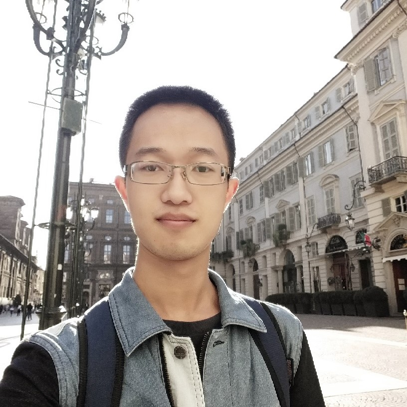

## About Me

Hi, I'm Xisen Jin. I am a junior year student of Fudan University, China, majored in Computer Science and Technology.

I'm aspired for academic research and I'm planned for a Ph.D. I also enjoy building interesting stuffs by programming.
 

## Research Interest

- Natural Language Processing
    - Goal-oriented dialogue agents, Question answering, and Foundamentals(linguistic matters).
- Machine Learning
    - Exploring ways to effectively learn representations for data. Pursuing ways to few-data learning.
 

## Education

<b>Fudan University,</b> 2015.9 -

<b>National University of Singapore</b> 2017.8 - 2017.12
 

## Research & Interns

<b>Natural Language Processing Group</b>, School of Data Science

Research Assistant, From Oct. 2017 to present

  - Director: [Dr. Zhongyu Wei](https://wei-zhongyu.github.io/)

<b>[Web Information Retrieval / Natural Language Processing Group (WING)](http://wing.comp.nus.edu.sg/)</b>, National University of Singapore

Research Assistant, From Aug. 2017 to Dec. 2017
- Director: Wenqiang Lei, [Dr. Min-Yen Kan](http://www.comp.nus.edu.sg/~kanmy/)

<b>[Data Science Lab, JD.com](http://datascience.jd.com)</b>, Beijing, China

Algorithm Engineer, Research Assistant, From Dec. 2017 to Feb. 2018
- Director: [Dr. Zhaochun Ren](https://sites.google.com/site/zren87/), [Dr. Dawei Yin](http://www.yindawei.com/)
 

## Publications

1. Wenqiang Lei, **Xisen Jin**, Min-Yen Kan, Zhaochun Ren, Xiangnan He and Dawei Yin, Sequicity: Simplifying Task-oriented Dialogue Systems with Single Sequence-to-Sequence Architectures, ACL 2018, Full paper.

2. Two papers under effort.
 

## Projects
- Wheels: 
    - [Batched-Attention GRU in PyTorch](https://github.com/AuCson/PyTorch-Batch-Attention-Seq2seq)

- Softwares: 
    - [GRE-Verbal-Prep-3000](https://github.com/AuCson/GRE-3000-Memory-Helper)
    - [Arxiv Digest](https://aucson.github.io/arxiv_digest.html)
    
    Simple(less than 3 hours' work) but useful(at least to myself).

- Codes for Papers:
    - Available Once Accepted

- Blogs:
    - [Machine Learning](https://aucson.github.io/ml-techblog/)
    - [Leetcode Personal Solution](https://aucson.gitbooks.io/leetcode-rec/content/)
 

## Awards
- National Scholarship for undergraduates, 2016 & 2017
- IshamWork software competion, first-runner up
- Microsoft Beauty of Programming, 16/1000
 

## Abilities
- Proficient: Python, PyTorch
- Skilled: C++, Tensorflow, Web/Android Development
- Independent research ability
- English
- Korean :p Cuz I'm *ethnically* Korean: Kim Hee Sam is my korean name pronunciation. 
 
